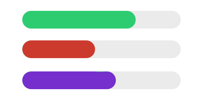

# challenges

## challenge #1

Let's have some fun with progress bars! 😁

Given the following markup:

``` html
<div class="progress-loader" data-progress="10" data-color="#e67e22"></div>
<div class="progress-loader" data-progress="20"></div>
<div class="progress-loader"></div>
<div class="progress-loader" data-progress="50"></div>
<div class="progress-loader" data-progress="70" data-color="rgb(41,128,185)"></div>
```

``` json
 {
     "class": {
         "required": true,
         "description": "The class that signals our library that this element is a progress loader."
     },
     "data-progress": {
         "requried": false,
         "defaultValue": 0,
         "descriptions": "The data attribue that will hold the current value displayed by the progress bar"
     },
     "data-color": {
        "required": false,
        "defaultValue": "rgb(46,204,113)",
        "description": "The color of the progress bar fill"
     }
 }
```

This code should run untill all the loaders reach `100%` 🥱😴🥱:

``` javascript
 const loaderElementList = Array.from(document.querySelectorAll < HTMLElement > ('.progress-loader'));
 const loaderList = loaderElementList.map(element => new ProgressLoader(element));
 const finishedIdxList = new Set();

 const handle = setInterval(() => {
     if (finishedIdxList.size === loaderList.length) {
         clearInterval(handle);
         return;
     }

     let randomIdx;
     do {
         randomIdx = Math.floor(Math.random() * loaderList.length)
     } while (finishedIdxList.has(randomIdx));

     const loader = loaderList[randomIdx];

     if (loader.isDone) {
         finishedIdxList.add(randomIdx);
     } else {
         loader.progress += 10;
     }
 }, 300 * Math.random());
```

And here's a small layout of our expected API 😎:

``` typescript
    // Progress API
    declare class ProgressLoader {
        constructor(element: HTMLElement);
        get isDone: boolean;
        get progress(): number;
        set progress(value: number): void;
    }
```

Expected visual appearance:



## challenge #2

Generate a random Matrice of `columns` / `rows` that contains either a `1` or a `0` (logical map).

eg:

```
This would be a generated matrice for:

columns = 5
rows = 6

1-1-0-0-1
1-0-0-0-0
0-0-0-0-1
1-1-0-1-1
1-1-1-1-1
0-0-0-0-0
```

After generating this matrice, we need to render a UI `div` grid which has colored elements inside the positions that contain a `1` and an empty element where we have a `0` .

The color of the elements can be either random or static, depending on preference (it would be nice if random, to have the same color for each generation).

A visual aid for the above example would be:


The generation / rendering should happen every 6 seconds.

When you click the colored elements, it's `x` and `y` positions in the matrice should be output to the console like so:

``` json
{ x: 1, y: 2 }
```

Quick notes:

    - there should be a class that handles the drawing (eg: `MatriceRenderer` )
    - there should be a method that generates a random matrice (eg: `generateMatrice` )
    - there should be a handler that re-renders / redraws for the specified inteval (could be the main app?)

# challenge #3

## 3a

Implement challenge #1 using `canvas` .

## 3b

Implement challenge #2 using `canvas` .

I recommend the constructor options definition to be something like this:

``` ts
interface MatrixClickEvent {
    column: number;
    row: number;
}

interface MatrixOptions {
    color: string;
    matrix: number[][];
    onClick: (ev: MatrixClickEvent) => void;
}

class Matrix {
    // destructure object
    constructor({
        color,
        matrix,
        onClick,
    }: MatrixOptions) {}
}
```

# challenge #4

We need to define a canvas area on which we draw a square:
 - color is not important
 - size is not important
 - the square falls down a bit (can be half the height) every 1-2 seconds
 - when the square reaches the bottom of the canvas it should stop moving completely

Use the keys W, A, S, D or ArrowUp, ArrowLeft, ArrowDown, ArrowRight to control the position of the square on the canvas.

If the square reaches the right side, it needs to start drawing on the left side (circular infinity) and the same for the left side.

# Project - Tetris

The specifications for the game can be found here: https://en.wikipedia.org/wiki/Tetris#Gameplay

We need to extract classes and implement the game using this as a gameplay demo example: https://en.wikipedia.org/wiki/File:Tetris_basic_game.gif (we can make the styling prettier ofc)

## TODO's:

### Menu
- New Game
- Pause

### Statistics
- Lines
- Time

## Optionals (bonus things):

### Menu
- High Score

### Statistics
- Level
- Score
- APM
